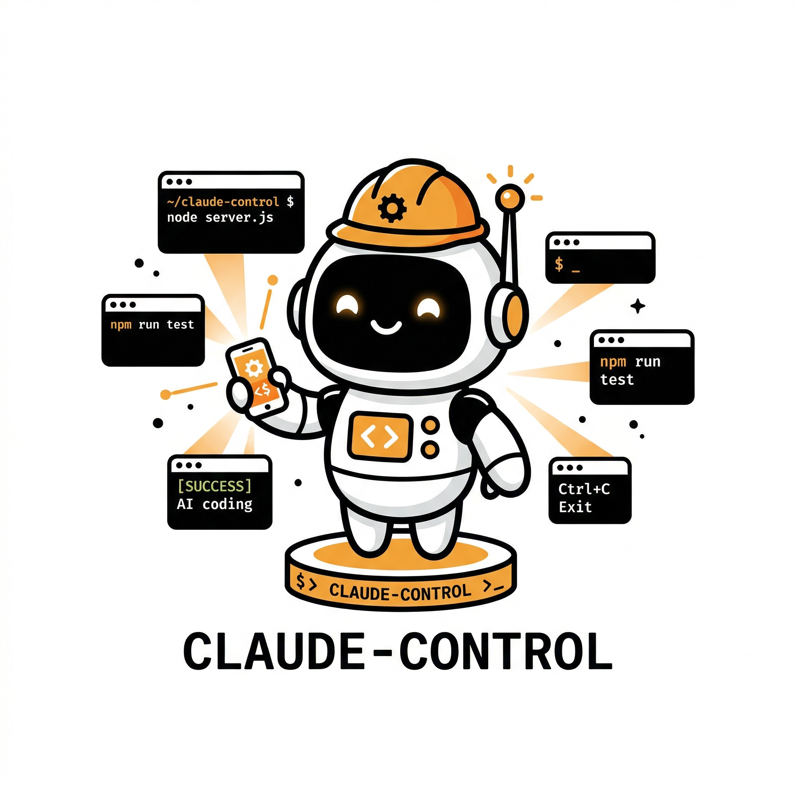
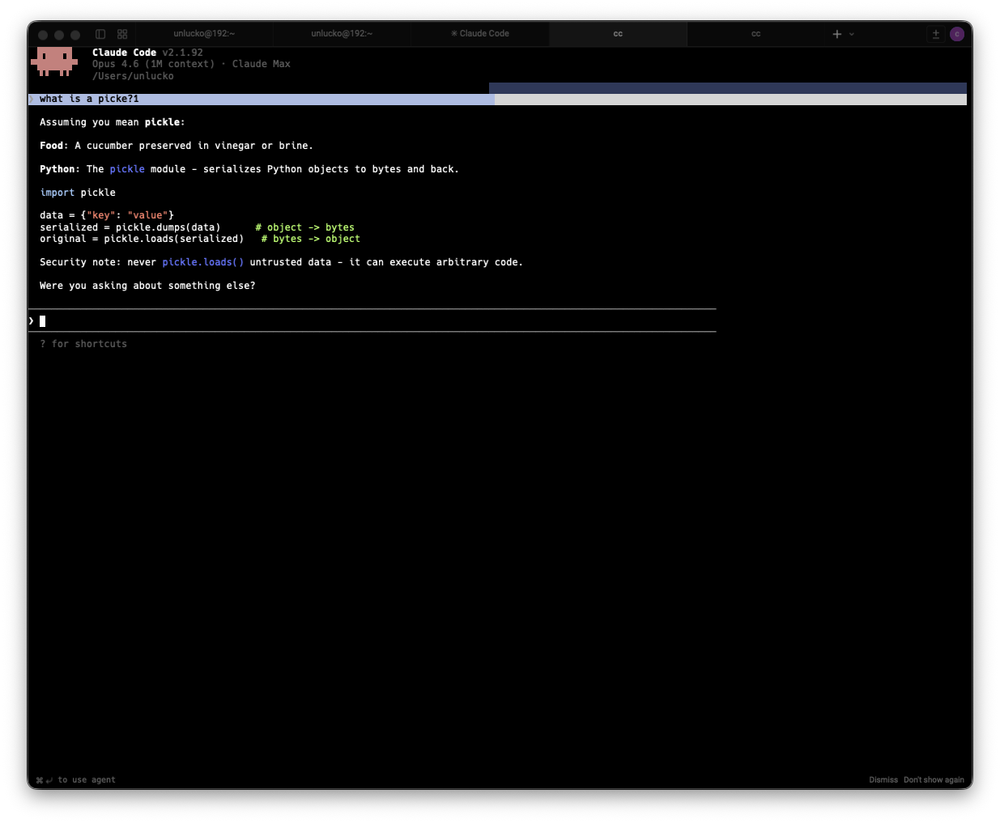
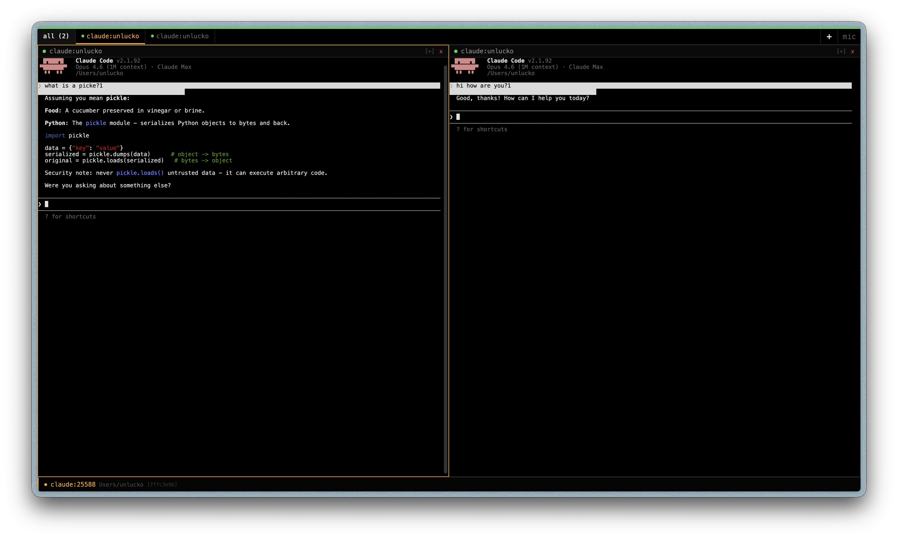

<p align="center">
  
</p>

<h1 align="center">claude-control</h1>

<p align="center">Mobile-first remote control for Claude Code sessions via HTTPS + WebSocket with real PTY.</p>

<p align="center">
  
  
</p>

## Features

- **Tiling window manager** - View multiple sessions side by side, tap any tile to expand fullscreen, tap again to collapse back to grid
- **Real PTY via node-pty** - Claude Code requires a real TTY for interactive mode; this provides one over the network
- **Permission detection** - Parses terminal output in real time to detect when Claude asks for tool approval (Bash, Read, Write, Edit, etc.), shows Allow/Deny buttons on your phone
- **Voice input** - Dictate prompts via Web Speech API instead of typing on a small screen
- **PWA installable** - Add to Home Screen on iPhone for a native app experience with no browser chrome
- **System process scanner** - Detects already-running `claude` processes on the host so you can attach to them
- **Agent presets** - Pre-configured launch profiles (default, reviewer, db-analyst, autonomous)
- **Cloudflare Tunnel** - Access your sessions from anywhere, not just your LAN
- **Self-signed TLS via mkcert** - HTTPS is required for WebSocket on iOS Safari and PWA installation

## Architecture

```
iPhone/Browser (PWA)
       |
       | HTTPS + WSS (port 4000)
       |
+------v----------------------------------------------+
|              claude-control server                   |
|  +--------------+   +-----------------------------+  |
|  |  REST API    |   |   WebSocket Server          |  |
|  |  (Express)   |   |   real-time output stream   |  |
|  +--------------+   +-----------------------------+  |
|  +------------------------------------------------+  |
|  |           Session Manager                      |  |
|  |  Map<id, { pty, scrollback, subscribers }>     |  |
|  +------------------------------------------------+  |
+------------------------------------------------------+
       |  node-pty
 +-----+------+  +------------+  +----------+
 | claude PTY |  | claude PTY |  | zsh PTY  |
 | (agent A)  |  | (agent B)  |  | terminal |
 +------------+  +------------+  +----------+
```

**Server components:**

| File | Purpose |
|------|---------|
| `server/index.ts` | HTTPS server, Express mount, WebSocket upgrade |
| `server/session-manager.ts` | PTY lifecycle, 10k-chunk scrollback ring buffer, fan-out to WS subscribers |
| `server/process-launcher.ts` | Build spawn commands for claude/terminal, agent presets |
| `server/api.ts` | REST endpoints with Bearer auth |
| `server/ws-handler.ts` | WebSocket protocol handler |
| `server/system-scanner.ts` | Scan host for running claude processes |
| `server/types.ts` | Shared TypeScript interfaces |

**Client stack:** React 19 + Zustand + Xterm.js + Vite

## Quick Start

### 1. Install dependencies

```bash
npm install
cd client && npm install && cd ..
```

### 2. Generate TLS certificates

```bash
# requires mkcert: brew install mkcert
npm run gen-certs
```

This creates `certs/cert.pem` and `certs/key.pem` for localhost, 127.0.0.1, and your LAN IP.

### 3. Configure .env

```env
PORT=4000
CONTROL_TOKEN=your-secret-token-here
```

### 4. Build the client

```bash
npm run build:client
```

### 5. Start the server

```bash
# development (auto-reload)
npm run dev

# production
npm run build
npm start

# production with PM2 (auto-start on boot)
npm install -g pm2
pm2 start ecosystem.config.js
pm2 startup   # follow the output to enable boot persistence
pm2 save
```

Server runs at `https://localhost:4000`.

## Mobile Setup

### LAN Access

1. Find your Mac's IP: `ipconfig getifaddr en0`
2. Open `https://<your-ip>:4000` on your phone
3. Enter your `CONTROL_TOKEN` when prompted

### Trust the certificate (iOS)

To avoid "Not Secure" warnings:

1. Install the mkcert root CA: `mkcert -install`
2. Send `~/.local/share/mkcert/rootCA.pem` to your phone (AirDrop works)
3. On iOS: Settings > General > VPN & Device Management > Install the profile
4. Settings > General > About > Certificate Trust Settings > Enable full trust

### Install as PWA

In Safari, tap Share > Add to Home Screen. The app launches fullscreen without browser chrome.

## Remote Access via Cloudflare Tunnel

Access your sessions from outside your LAN without opening ports:

```bash
brew install cloudflare/cloudflare/cloudflared
cloudflared tunnel --url https://localhost:4000
```

This gives you a public `*.trycloudflare.com` URL with SSL included. No account required for quick tunnels.

## API Reference

All REST endpoints require the header: `Authorization: Bearer <CONTROL_TOKEN>`

### REST Endpoints

| Method | Route | Description |
|--------|-------|-------------|
| GET | `/api/health` | Server status and session count |
| GET | `/api/sessions` | List all active sessions |
| POST | `/api/sessions` | Create a new session |
| GET | `/api/sessions/:id` | Get session details |
| DELETE | `/api/sessions/:id` | Kill and remove a session |
| POST | `/api/sessions/:id/input` | Send text to the PTY |
| POST | `/api/sessions/:id/resize` | Resize the terminal |
| GET | `/api/agents` | List available agent presets |
| GET | `/api/system-sessions` | Scan for running claude processes on the host |

### POST /api/sessions

```json
{
  "type": "claude",
  "name": "my-session",
  "agent": "db-analyst",
  "cwd": "~/projects/my-app",
  "claudeSessionId": "abc123"
}
```

| Field | Type | Description |
|-------|------|-------------|
| `type` | `"claude" \| "agent" \| "terminal"` | Session type (default: `"claude"`) |
| `name` | `string` | Display name (optional) |
| `agent` | `string` | Agent preset ID (optional, claude/agent types only) |
| `cwd` | `string` | Working directory, supports `~` (optional) |
| `claudeSessionId` | `string` | Resume an existing Claude Code session (optional) |

### POST /api/sessions/:id/input

```json
{ "data": "echo hello\n" }
```

### POST /api/sessions/:id/resize

```json
{ "cols": 120, "rows": 40 }
```

### WebSocket Protocol

Connect to: `wss://<host>:4000/ws?token=<CONTROL_TOKEN>`

**Client -> Server:**

```json
{ "type": "subscribe",   "sessionId": "..." }
{ "type": "unsubscribe", "sessionId": "..." }
{ "type": "input",       "sessionId": "...", "data": "ls\n" }
{ "type": "resize",      "sessionId": "...", "cols": 120, "rows": 40 }
{ "type": "ping" }
```

**Server -> Client:**

```json
{ "type": "sessions",       "sessions": [...] }
{ "type": "session_created", "session": {...} }
{ "type": "session_deleted", "sessionId": "..." }
{ "type": "scrollback",     "sessionId": "...", "data": "..." }
{ "type": "data",           "sessionId": "...", "data": "..." }
{ "type": "session_exit",   "sessionId": "...", "code": 0 }
{ "type": "error",          "message": "..." }
{ "type": "pong" }
```

On subscribe, the server replays the full scrollback buffer so you see session history immediately.

## Agent Presets

Defined in `server/process-launcher.ts`. Add new presets by editing `AGENT_PRESETS`.

| ID | Description | Flags |
|----|-------------|-------|
| `default` | Standard interactive Claude | (none) |
| `reviewer` | Code reviewer - plan mode, no auto-changes | `--permission-mode plan` |
| `db-analyst` | PostgreSQL/Azure analyst with DB-focused system prompt | `--append-system-prompt ...` |
| `autonomous` | Autonomous agent, no confirmations (use with caution) | `--dangerously-skip-permissions` |

## Configuration

| Variable | Default | Description |
|----------|---------|-------------|
| `PORT` | `4000` | HTTPS server port |
| `CONTROL_TOKEN` | (required) | Bearer token for API and WebSocket auth |

## Project Structure

```
claude-control/
├── server/
│   ├── index.ts             # HTTPS entry point
│   ├── session-manager.ts   # PTY lifecycle + scrollback
│   ├── process-launcher.ts  # Spawn commands + agent presets
│   ├── api.ts               # REST routes
│   ├── ws-handler.ts        # WebSocket protocol
│   ├── system-scanner.ts    # Detect running claude processes
│   └── types.ts             # TypeScript interfaces
├── client/                  # React + Vite PWA
│   └── src/
│       ├── App.tsx
│       ├── store.ts         # Zustand store + WS client
│       ├── permissions.ts   # Permission prompt detection
│       └── components/
│           ├── TilingLayout.tsx
│           ├── TerminalTile.tsx
│           └── TokenInput.tsx
├── certs/                   # TLS certs (generated, gitignored)
├── ecosystem.config.js      # PM2 config
├── package.json
└── tsconfig.json
```

## Roadmap

- [x] PTY server core with REST API and WebSocket
- [x] Mobile PWA client (React + Xterm.js + Zustand)
- [x] Tiling window manager UI
- [x] Permission detection with Allow/Deny buttons
- [x] Agent presets
- [x] System process scanner
- [x] Self-signed TLS via mkcert
- [ ] Voice input via Web Speech API
- [ ] Claude Code Hooks integration (status notifications across tabs)
- [ ] Supervisor agent via MCP

## Technical Notes

**Why node-pty?**
Claude Code detects whether it is connected to a real TTY. Without a PTY, interactive mode does not work.

**Why mkcert?**
HTTPS is mandatory for: secure WebSocket on iOS Safari, PWA Add to Home Screen, and the Clipboard API.

**Scrollback buffer:**
Ring buffer of up to 10,000 output chunks per session. When you subscribe to a session, the server replays the full buffer so you can see history.

**Security:**
Bearer token on all REST endpoints and as a query parameter on WebSocket (`?token=`). The Bearer scheme is immune to CSRF by design. For remote access, use Cloudflare Tunnel for additional encryption. Never expose port 4000 directly to the internet.

## License

MIT
